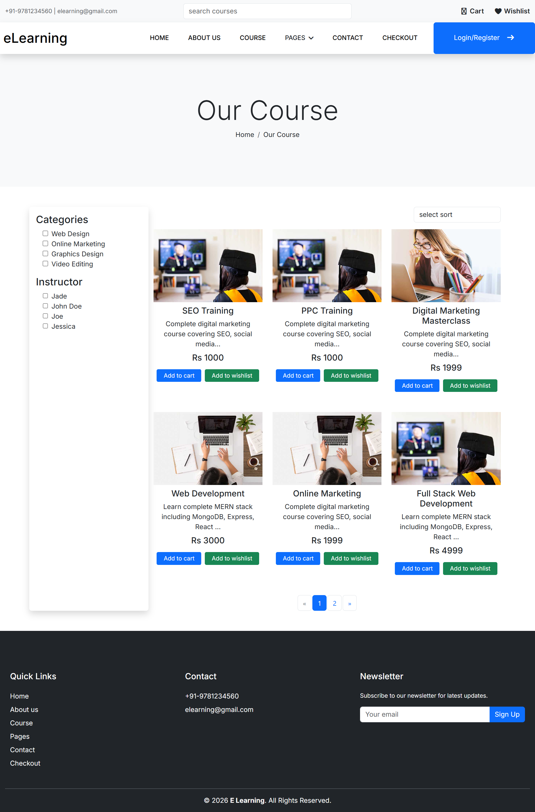

## 📸 Screenshots

### 🏠 Home Page


### 📚 Course Page


# 📚 E-Learning Platform

A full-stack E-Learning web application built using the MERN stack. This platform allows users to explore courses, enroll, and manage their learning through a dynamic dashboard.

## 🚀 Live Demo
https://e-learning-frontend-f9or.onrender.com/

## 📌 Features
- User Authentication & Authorization (JWT)
- Course listing and detailed course pages
- User enrollment system
- Personalized dashboard
- RESTful API integration
- Fully responsive design

## 🛠️ Tech Stack
- Frontend: Next.js (React), HTML, CSS, JavaScript
- Backend: Node.js, Express.js
- Database: MongoDB
- Authentication: JWT
- Deployment: Render

## 💳 Payment Integration
- Integrated payment gateway for course purchases
- Secure transaction handling and order confirmation

## ⚙️ Setup

```bash
git clone https://github.com/suryadevaraBalakrishna/E-Learning.git
cd E-Learning
npm install
npm run dev
